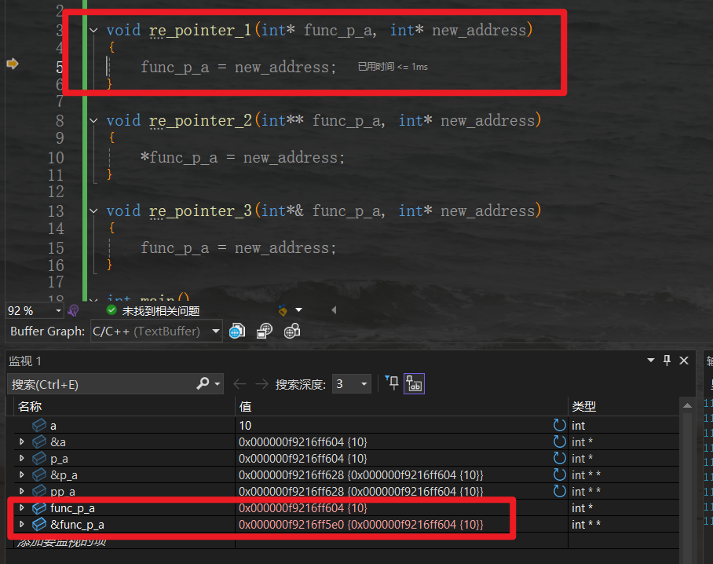
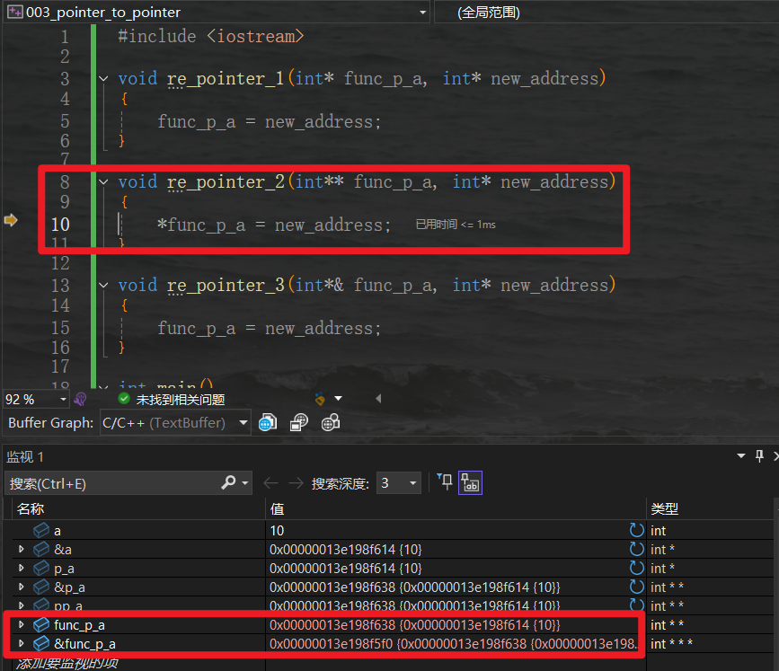

# 学习c++的一些笔记

### pass by value and pass by reference and pass by address
* pass by value: 传递的是值的副本，对副本的修改不会影响原变量。
* pass by reference: 传递的是变量的引用，对引用的修改会影响原变量。
* pass by address: 传递的是变量的地址，对地址的修改会影响原变量。 
```cpp
#include <iostream>
 // pass by value
void modifyValue(int a)
{
	a = 10;
}

// pass by reference
void modifyReference(int& a)
{
	a = 10;
}

// pass by pointer
void modifyPointer(int* a)
{
	*a = 10;
}

int main()
{
	int a = 5;
	std::cout << "Original value: " << a << std::endl;
	modifyValue(a);
	std::cout << "After modifyValue: " << a << std::endl;

	a = 5; // reset value
	std::cout << "Original value: " << a << std::endl;
	modifyReference(a);
	std::cout << "After modifyReference: " << a << std::endl;

	a = 5; // reset value
	std::cout << "Original value: " << a << std::endl;
	modifyPointer(&a);
	std::cout << "After modifyPointer: " << a << std::endl;

	int b = 5;
	int* p_b = &b;
	std::cout << "Original value: b = " << b << std::endl;
	std::cout << "Original value: *p_b = " << *p_b << std::endl;
	modifyPointer(p_b);
	std::cout << "After modifyPointer: b = " << b << std::endl;
	std::cout << "After modifyPointer: *p_b = " << *p_b << std::endl;
}
```
output:
```bash
Original value: 5
After modifyValue: 5
Original value: 5
After modifyReference: 10
Original value: 5
After modifyPointer: 10
Original value: b = 5
Original value: *p_b = 5
After modifyPointer: b = 10
After modifyPointer: *p_b = 10
```

### 指针的指针 值传递和指针传递
如果需要在函数内部修改指针的指向（即让指针指向一块新的内存），函数的参数必须是指针的指针（int**）或指针的引用（C++ 中的 int*&）
```cpp
#include <iostream>

void re_pointer_1(int* func_p_a, int* new_address)
{
	func_p_a = new_address;
}

void re_pointer_2(int** func_p_a, int* new_address)
{
	*func_p_a = new_address;
}

void re_pointer_3(int*& func_p_a, int* new_address)
{
	func_p_a = new_address;
}

int main()
{
	int a = 10;
	int* p_a = &a;
	int** pp_a = &p_a;
	int b = 20;

	std::cout << "Value of a: " << a << std::endl;
	std::cout << "Address of a: " << &a << std::endl;
	std::cout << "Value of p_a: " << p_a << std::endl;
	std::cout << "Address of p_a:" << &p_a << std::endl;
	std::cout << "Value of pp_a: " << pp_a << std::endl;
	std::cout << "Address of pp_a: " << &pp_a << std::endl;

	std::cout << "Value pointed to by p_a: " << *p_a << std::endl;
	std::cout << "Value pointed to by pp_a: " << *pp_a << std::endl;
	std::cout << "Value pointed to by pp_a (dereferencing twice): " << **pp_a << std::endl;

	re_pointer_1(p_a, &b);
	// re_pointer_2(&p_a, &b);
	// re_pointer_3(p_a, &b);

	std::cout << *p_a << std::endl;
}
```
    
因为c++是值传递，这里的func_p_a是p_a的副本，所以func_p_a的修改不会影响p_a。可以发现，这里的func_p_a和p_a的地址是不同的，但是它们的值是相同的。    
    
这里函数传入的是指针的指针，传入的是p_a的地址，所以func_p_a的修改会影响p_a。

**需要使用二级指针或者多级指针的情况：**
  1. 动态内存分配并返回给外部指针
  2. 修改链表/树的头指针
  3. 动态创建二维数组（指针数组）
  4. 函数返回多个指针
  5. 回调函数中修改外部指针
  6. 字符串数组（char**）的动态操作
  7. 多级间接寻址（如函数指针数组）   
在 C++ 中，可用 指针的引用（如 int*&）替代二级指针  
***核心规则：若需修改某个指针的值（而非其指向的内容），必须传递该指针的地址（即二级指针）！***


### const和static 
1. const    
const 用于定义常量或限制变量、函数、指针等的修改行为，表示“不可修改”。
 - 修饰变量 声明一个常量，值不可修改。
    ```
    const int MAX_SIZE = 100; // 常量，不能修改
    // MAX_SIZE = 200; // 错误！不能修改 const 变量
    ```
 -  修饰指针    
        const 可以修饰指针本身或指针指向的数据：

        在使用const时，如果关键字const出现在星号左边，表示被指物是常量；如果出现在星号右边，表示指针本身是常量；如果出现在星号两边，表示被指物和指针两者都是常量。

        const int* ptr：指针指向的数据是常量，不能通过 ptr 修改。

        int* const ptr：指针本身是常量，不能修改指针的指向。

        const int* const ptr：指针和它指向的数据都是常量


    ```cpp
    int a = 10, b = 20;
    const int* ptr1 = &a; // 指向的数据是 const
    // *ptr1 = 30; // 错误！不能修改指向的数据
    ptr1 = &b;     // 可以修改指针的指向

    int* const ptr2 = &a; // 指针本身是 const
    *ptr2 = 30;     // 可以修改指向的数据
    // ptr2 = &b;   // 错误！不能修改指针的指向

    const int* const ptr3 = &a; // 指针和指向的数据都是 const
    // *ptr3 = 40; // 错误！
    // ptr3 = &b;  // 错误！
    ```

- 修饰函数参数:防止函数内部修改传入的参数         
    ```cpp
    void printData(const int* data, int size) {
        for (int i = 0; i < size; i++) {
            // data[i] = 0; // 错误！不能修改 const 数据
            cout << data[i] << " ";
        }
    }
    ```
-  修饰成员函数
表示该函数不会修改类的成员变量（只能调用其他 const 成员函数）。
    ```cpp
    class MyClass {
        int value;
    public:
        int getValue() const { // const 成员函数
            // value = 10; // 错误！不能修改成员变量
            return value;
        }
    };
    ```
- 修饰返回值
表示函数返回的是常量，不能通过返回值修改外部变量。
    ```cpp
    const int* getData() {
        static int data = 42;
        return &data;
    }

    int main() {
        const int* ptr = getData();
        // *ptr = 100; // 错误！不能修改 const 返回值
        return 0;
    }
    ```

2. static
static 用于定义静态变量、静态函数、静态成员等，具有以下特点：
 - 修饰局部变量    
使局部变量的生命周期延长到整个程序运行期间（但作用域仍限于函数内）。   
变量只初始化一次，后续调用保持之前的值。
    ```cpp
    void counter() {
        static int count = 0; // 只初始化一次
        count++;
        cout << count << endl;
    }

    int main() {
        counter(); // 输出 1
        counter(); // 输出 2
        counter(); // 输出 3
        return 0;
    }
    ```
 - 修饰全局变量/函数    
  限制全局变量或函数的作用域，使其仅在当前文件可见（防止命名冲突）
    ```cpp
    // file1.cpp
    static int localVar = 42; // 只在 file1.cpp 可见
    static void localFunc() {} // 只在 file1.cpp 可见

    // file2.cpp
    extern int localVar; // 错误！无法访问 file1.cpp 的 static 变量
    ```
 - 修饰成员变量
  静态成员变量属于类，不属于任何对象，所有对象共享该变量。必须在类外初始化
    ```cpp
    class MyClass {
    public:
        static int count; // 声明
        MyClass() { count++; }
    };

    int MyClass::count = 0; // 必须初始化

    int main() {
        MyClass obj1, obj2;
        cout << MyClass::count; // 输出 2（所有对象共享）
        return 0;
    }
    ``` 
 - 修饰成员函数    
    静态成员函数属于类，而不是某个对象，可以直接通过类名调用。
    静态成员函数不能访问非静态成员变量（需要通过对象访问），但可以访问静态成员变量。
    ```cpp
    class MyClass {
    public:
        static void printCount() {
            // cout << value; // 错误！不能访问非静态成员
            cout << "Count: " << count << endl;
        }
        static int count;
        int value;
    };

    int MyClass::count = 0;

    int main() {
        MyClass::printCount(); // 直接调用，无需对象
        return 0;
    }
    ```
3. const 和 static 的组合使用    
   static const：表示静态常量（通常用于类的常量成员）
    ```cpp
    class Math {
    public:
        static const double PI = 3.14159; // 静态常量
    };
    ```


### 全局变量 静态局部变量 静态全局变量

|    特性    |     全局变量     |     静态局部变量     |   静态全局变量   |
| :--------: | :--------------: | :------------------: | :--------------: |
|   作用域   |     文件全局     |   函数内部(static)   | 文件内部(static) |
|   存储期   |    静态存储期    |      静态存储期      |    静态存储期    |
|   链接性   |     外部链接     |        无链接        |     内部链接     |
| 初始化次数 |       一次       | 一次(首次调用函数时) |       一次       |
|   可见性   | 可被其他文件访问 |     仅函数内可见     |   仅本文件可见   |

**静态变量（无论是局部还是全局）的主要特点是它们保持其值在程序的整个生命周期内，但限制了其可见范围，这有助于实现信息隐藏和模     块化编程。**    

### c++中各种变量的存储区域
- 静态存储区：存放全局变量、静态变量、常量
- 栈区：存放局部变量、函数参数
- 堆区：动态分配的内存(new/malloc)
- 代码区：存放程序的执行代码

详细内容参考：[C++内存模型](https://www.cnblogs.com/lqerio/p/12110482.html#%E5%8A%A8&%E9%9D%99)


### constexpr 常量表达式
const对象表示表明值不会改变，但是在编译的时候并不一定能取得结果     
constexpr是const的一种加强，constexpr对象的值不仅不变，而且在编译时就能取得结果    
如果一个const变量在编译的时候就能取得结果，那么使用constexpr修饰他更好  
      

constexpr函数可以把运行时的计算移到编译时，但是会增加编译时间。如果函数体很复杂，编译器可能会选择不在编译时计算   


constexpr 全称是constant expression，表示常量表达式   
常量表达是指值不会改变，并且在编译时就能取得结果

特点：值不会改变，编译时就能取得结果，编译器会在编译时计算出值并替换掉变量名。

使用场景：
* 数组大小
* 整型模板实参
* switch-case 中的case标签
* 枚举量的值
* 对齐规格
  
```cpp
int i1 = 42;  // i1不是常量表达式
const int i2 = i1;  // i2不是常量表达式：初始值i1不是常量表达式
const int i3 = 42;  // i3是常量表达式
const int i4 = i3;  // i4是常量表达式：初始值i3是常量表达式
const int i5 = get_size();  // 因为get_size()是普通函数，运行时才能确定，所以i5不是常量表达式
```

```cpp
int i1 = 42;
constexpr int i2 = i1;  // 报错：表达式必须含有常量值。因为constexpr变量i2必须使用常量表达式初始化，不允许在常量表达式中读取非const变量
constexpr int i3 = 42;  // i3是常量表达式
constexpr int i4 = i3 + 1;  // i4是常量表达式：初始值i3是常量表达式
constexpr int i5 = get_size(); // 报错：表达式必须含有常量值。因为get_size()时constexpr函数才可以
constexpr int i6 = get_size2(); // i6是常量表达式：初始值get_size2()是常量表达式
```
constexpr函数是指能用于常量表达式的函数，函数的返回类型和所有的形参的类型都要是字面值类型，而且函数中有且只有一个return语句。    
**constexpr函数不一定返回常量表达式**
```cpp
constexpr int sum(int a, int b)
{
    return a + b;
}

constexpr int i2 = sum(a, b);  // 所有参数都是常量表达式，sum 的结果也是常量表达式，在编译期求值

int AddThree(int a)
{
    return  sum(a, 3);  // // i 不是常量表达式，此时 sum 作为普通函数使用
}
```
constexpr的好处
1. 编译器可以保证 constexpr 对象是常量表达式（能够在编译期取得结果），而 const 对象不能保证。如果一个 const 变量能够在编译期求值，将其改为 constexpr 能够让代码更清晰易读
2. constexpr 函数可以把运行期计算迁移至编译期，使得程序运行更快（但会增加编译时间）

