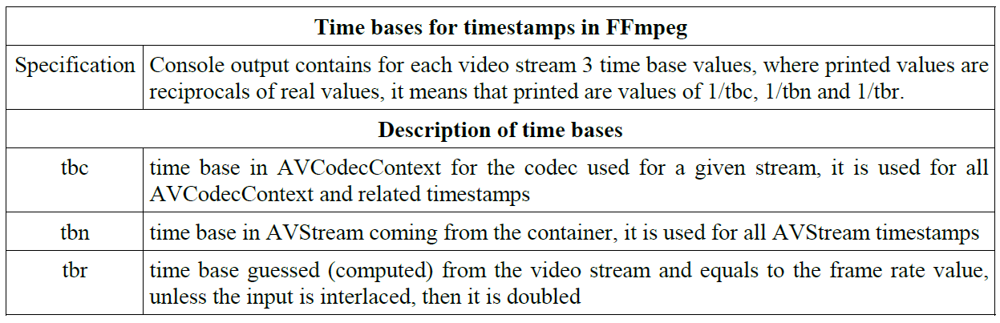
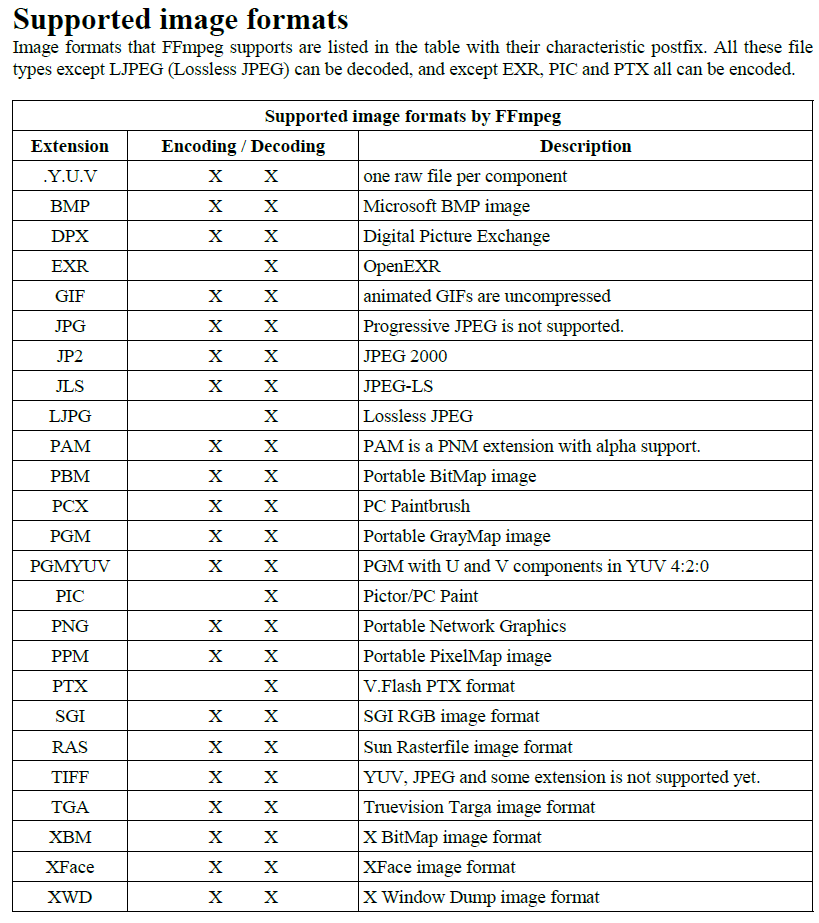

### 命令行基本语法
```shell
ffmpeg [global opetions] [input file options] -i input_file [output file options] putput_file
```

可以使用ffplay命令播放视频, 例如
```shell
ffplay -i input.mp4
```
推出播放界面使用q键

ffmpeg的滤镜是一个处理视频的函数, 可以对视频进行各种操作, 例如
```shell
ffmpeg -i input.mp4 -vf "scale=320:240" output.mp4
```
滤镜 filterchains 和 filtergraphs
filterchains: 多个滤镜组成的链, 例如
```shell
# 将input.mp4的视频进行hqdn3d处理, 然后比较处理前后的视频,使用filterchains需要两条命令
ffmpeg -i input.mp4 -vf hqdn3d,pad=2*iw output.mp4
ffmpeg -i output.mp4 -i input.mp4 -filter_complex overlay=w compare.mp4
```
filtergraphs: 多个filterchains组成的图, 例如
```shell
# 将input.mp4的视频进行hqdn3d处理, 然后比较处理前后的视频，使用filtergraphs需要一条命令
ffplay -i input.mp4 -vf split[a][b];[a]pad=2*iw[A];[b]hqdn[B];[A][B]overlay=w compare.mp4
```

### 设置视频的帧率
在输出文件前使用 -r
```shell
ffmpeg -i input.mp4 -r 30 output.mp4
```
使用fps filter
```shell
ffmpeg -i input.mp4 -vf fps=fps=30 output.mp4
```

还有一些预定义的帧率值

### bit rate
决定整个视频和音频的质量，它指定每个时间单位处理的位数，在 FFmpeg 中，比特率以每秒位数表示。
存储1秒编码流所使用的总位数，称为比特率。
比特率越高，视频的质量就越好，但是文件的大小也会更大。
比特率越低，视频的质量就越差，但是文件的大小也会更小。
比特率的单位是 bps（比特每秒），也可以用 kbps（千比特每秒）或 Mbps（兆比特每秒）来表示。
```shell
# 设置每秒1.5Mbit 的比特率
ffmpeg -i input.mp4 -b:v 1.5M output.mp4
```


```shell
# 设定恒定比特率
ffmpeg -i input.mp4 -b 0.5M -minrate 0.5M -maxrate 0.5M -bufsize 1M output.mp4
```

```shell
# 设定输出文件的最大大小
ffmpeg -i input.mp4 -fs 10M output.mp4
```
### 计算文件大小


### AVFormatContext结构体
```c
typedef struct AVFormatContext {
    const AVClass *av_class; // 用于日志记录和选项的类
    const struct AVInputFormat *iformat; // 输入容器格式
    const struct AVOutputFormat *oformat; // 输出容器格式
    void *priv_data; // 格式私有数据
    AVIOContext *pb; // I/O 上下文
    int ctx_flags; // 标志信号流属性
    unsigned int nb_streams; // 流的数量
    AVStream **streams; // 所有流的列表
    unsigned int nb_stream_groups; // 流组的数量
    AVStreamGroup **stream_groups; // 所有流组的列表
    unsigned int nb_chapters; // 章节的数量
    AVChapter **chapters; // 章节的列表
    char *url; // 输入或输出 URL
    int64_t start_time; // 组件的第一帧的位置
    int64_t duration; // 流的持续时间
    int64_t bit_rate; // 总流比特率
    unsigned int packet_size; // 包大小
    int max_delay; // 最大延迟
    int flags; // 修改 (de)muxer 行为的标志
    int64_t probesize; // 用于确定流属性的最大字节数
    int64_t max_analyze_duration; // 用于读取输入数据的最大持续时间
    const uint8_t *key; // 密钥
    int keylen; // 密钥长度
    unsigned int nb_programs; // 节目的数量
    AVProgram **programs; // 节目的列表
    enum AVCodecID video_codec_id; // 强制视频 codec_id
    enum AVCodecID audio_codec_id; // 强制音频 codec_id
    enum AVCodecID subtitle_codec_id; // 强制字幕 codec_id
    enum AVCodecID data_codec_id; // 强制数据 codec_id
    AVDictionary *metadata; // 应用于整个文件的元数据
    int64_t start_time_realtime; // 流的实际开始时间
    int fps_probe_size; // 用于确定帧速率的帧数
    int error_recognition; // 错误识别
    AVIOInterruptCB interrupt_callback; // 自定义中断回调
    int debug; // 调试标志
    int max_streams; // 最大流数量
    unsigned int max_index_size; // 用于每个流索引的最大内存量
    unsigned int max_picture_buffer; // 用于缓冲帧的最大内存量
    int64_t max_interleave_delta; // 最大缓冲持续时间
    int max_ts_probe; // 等待第一个时间戳时读取的最大包数
    int max_chunk_duration; // 最大块时间
    int max_chunk_size; // 最大块大小
    int max_probe_packets; // 最大探测包数
    int strict_std_compliance; // 允许非标准和实验扩展
    int event_flags; // 文件上发生的事件标志
    int avoid_negative_ts; // 避免负时间戳
    int audio_preload; // 音频预加载
    int use_wallclock_as_timestamps; // 使用挂钟时间作为时间戳
    int skip_estimate_duration_from_pts; // 跳过从 PTS 估算持续时间
    int avio_flags; // 用于强制 AVIO_FLAG_DIRECT 的标志
    enum AVDurationEstimationMethod duration_estimation_method; // 持续时间估算方法
    int64_t skip_initial_bytes; // 打开流时跳过的初始字节
    unsigned int correct_ts_overflow; // 校正单个时间戳溢出
    int seek2any; // 强制寻找到任何帧
    int flush_packets; // 每个包后刷新 I/O 上下文
    int probe_score; // 格式探测分数
    int format_probesize; // 用于识别输入格式的最大字节数
    char *codec_whitelist; // 允许的解码器列表
    char *format_whitelist; // 允许的解复用器列表
    char *protocol_whitelist; // 允许的协议列表
    char *protocol_blacklist; // 禁止的协议列表
    int io_repositioned; // IO 重新定位标志
    const struct AVCodec *video_codec; // 强制视频解码器
    const struct AVCodec *audio_codec; // 强制音频解码器
    const struct AVCodec *subtitle_codec; // 强制字幕解码器
    const struct AVCodec *data_codec; // 强制数据解码器
    int metadata_header_padding; // 元数据头的填充字节数
    void *opaque; // 用户数据
    av_format_control_message control_message_cb; // 设备与应用程序通信的回调
    int64_t output_ts_offset; // 输出时间戳偏移
    uint8_t *dump_separator; // 转储格式分隔符
    int (*io_open)(struct AVFormatContext *s, AVIOContext **pb, const char *url, int flags, AVDictionary **options); // 打开新 IO 流的回调
    int (*io_close2)(struct AVFormatContext *s, AVIOContext *pb); // 关闭 IO 流的回调
} AVFormatContext;
``` 

### AVStream结构体
```c
typedef struct AVStream {
    const AVClass *av_class; // 用于日志记录和选项的类
    int index; // 流在 AVFormatContext 中的索引
    int id; // 格式特定的流 ID，解码时由 libavformat 设置，编码时由用户设置
    AVCodecParameters *codecpar; // 与此流关联的编解码器参数
    void *priv_data; // 私有数据
    AVRational time_base; // 表示帧时间戳的基本时间单位
    int64_t start_time; // 流的第一帧的 PTS（显示顺序），以流时间基为单位
    int64_t duration; // 流的持续时间，以流时间基为单位
    int64_t nb_frames; // 流中的帧数，如果已知，否则为 0
    int disposition; // 流的处置标志，AV_DISPOSITION_* 标志的组合
    enum AVDiscard discard; // 选择可以随意丢弃的包，不需要解复用
    AVRational sample_aspect_ratio; // 采样纵横比（如果未知则为 0）
    AVDictionary *metadata; // 元数据
    AVRational avg_frame_rate; // 平均帧率
    AVPacket attached_pic; // 对于带有 AV_DISPOSITION_ATTACHED_PIC 处置的流，此包将包含附加图片
#if FF_API_AVSTREAM_SIDE_DATA
    AVPacketSideData *side_data; // 应用于整个流的附加数据数组
    int nb_side_data; // AVStream.side_data 数组中的元素数量
#endif
    int event_flags; // 指示流上发生的事件的标志，AVSTREAM_EVENT_FLAG_* 的组合
    AVRational r_frame_rate; // 流的实际基本帧率
    int pts_wrap_bits; // 时间戳中的位数，用于包装控制
} AVStream;
```

### AVCodecParameters结构体
```c
typedef struct AVCodecParameters {
    enum AVMediaType codec_type; // 编码数据的一般类型（视频、音频、字幕等）
    enum AVCodecID codec_id; // 编码数据的具体类型（使用的编解码器）
    uint32_t codec_tag; // 编解码器的附加信息（对应于 AVI FOURCC）
    uint8_t *extradata; // 初始化解码器所需的额外二进制数据，依赖于编解码器
    int extradata_size; // extradata 内容的大小（以字节为单位）
    AVPacketSideData *coded_side_data; // 与整个流相关的附加数据
    int nb_coded_side_data; // coded_side_data 中的条目数量
    int format; // 视频：像素格式，对应于 enum AVPixelFormat；音频：采样格式，对应于 enum AVSampleFormat
    int64_t bit_rate; // 编码数据的平均比特率（以比特每秒为单位）
    int bits_per_coded_sample; // 编码字中每个样本的位数，表示每个样本的比特率
    int bits_per_raw_sample; // 每个输出样本的有效位数，如果样本格式有更多位，则最不重要的位是额外的填充位
    int profile; // 编解码器特定的比特流限制，表示流符合的配置文件
    int level; // 编解码器特定的比特流限制，表示流符合的级别
    int width; // 视频帧的宽度（以像素为单位）
    int height; // 视频帧的高度（以像素为单位）
    AVRational sample_aspect_ratio; // 视频帧的像素宽高比（宽度/高度）
    AVRational framerate; // 视频帧率，对于具有恒定帧持续时间的流
    enum AVFieldOrder field_order; // 交错视频中字段的顺序
    enum AVColorRange color_range; // 颜色范围
    enum AVColorPrimaries color_primaries; // 颜色原色
    enum AVColorTransferCharacteristic color_trc; // 颜色传输特性
    enum AVColorSpace color_space; // 颜色空间
    enum AVChromaLocation chroma_location; // 色度位置
    int video_delay; // 视频延迟帧的数量
    AVChannelLayout ch_layout; // 音频的通道布局和通道数量
    int sample_rate; // 每秒音频样本数
    int block_align; // 每个编码音频帧的字节数
    int frame_size; // 音频帧大小，如果已知
    int initial_padding; // 编码器在音频开头插入的填充量（以样本为单位）
    int trailing_padding; // 编码器在音频末尾附加的填充量（以样本为单位）
    int seek_preroll; // 不连续后要跳过的样本数
} AVCodecParameters;
```


### AVCodec
```c
typedef struct AVCodec {
    const char *name;                     // 编解码器的名称，唯一标识符。例如："h264" 表示 H.264 编解码器。
    const char *long_name;                // 编解码器的描述性名称，便于人类阅读。例如："H.264 / AVC / MPEG-4 AVC / MPEG-4 part 10"。
    enum AVMediaType type;                // 编解码器的媒体类型。可能的值包括：
                                          // - AVMEDIA_TYPE_VIDEO（视频）
                                          // - AVMEDIA_TYPE_AUDIO（音频）
                                          // - AVMEDIA_TYPE_SUBTITLE（字幕）
    enum AVCodecID id;                    // 编解码器的唯一标识符。例如：AV_CODEC_ID_H264 表示 H.264。
    int capabilities;                     // 编解码器的能力标志，表示支持的功能。可能的标志包括：
                                          // - AV_CODEC_CAP_DRAW_HORIZ_BAND: 支持水平带绘制。
                                          // - AV_CODEC_CAP_DR1: 支持自定义缓冲区分配。
                                          // - AV_CODEC_CAP_DELAY: 支持延迟帧处理。
                                          // - AV_CODEC_CAP_FRAME_THREADS: 支持帧级多线程。
                                          // - AV_CODEC_CAP_SLICE_THREADS: 支持切片级多线程。
    uint8_t max_lowres;                   // 解码器支持的最大低分辨率值。
    const AVRational *supported_framerates; // 支持的帧率数组，终止于 {0, 0}。例如：{30, 1} 表示 30 FPS。
    const enum AVPixelFormat *pix_fmts;   // 支持的像素格式数组，终止于 -1。例如：AV_PIX_FMT_YUV420P 表示 YUV420 格式。
    const int *supported_samplerates;     // 支持的音频采样率数组，终止于 0。例如：44100 表示 44.1 kHz。
    const enum AVSampleFormat *sample_fmts; // 支持的音频采样格式数组，终止于 -1。例如：AV_SAMPLE_FMT_FLTP 表示浮点平面格式。
    const AVClass *priv_class;            // 私有上下文的 AVClass，用于日志记录和选项管理。
    const AVProfile *profiles;            // 支持的配置文件数组，终止于 {AV_PROFILE_UNKNOWN}。例如：H.264 支持 Baseline、Main 和 High 配置文件。
    const char *wrapper_name;             // 如果编解码器基于外部库实现，则此字段表示外部库的名称。例如："libx264" 表示基于 x264 的 H.264 编码器。
    const AVChannelLayout *ch_layouts;    // 支持的音频通道布局数组，终止于零值布局。例如：AV_CHANNEL_LAYOUT_STEREO 表示立体声布局。
} AVCodec;

```


### AvCodecContext
```c
typedef struct AVCodecContext {
    const AVClass *av_class;          // 用于日志记录的类信息，由 avcodec_alloc_context3 设置。
    int log_level_offset;             // 日志级别偏移量。

    enum AVMediaType codec_type;      // 媒体类型（如视频、音频、字幕）。
    const struct AVCodec *codec;      // 指向编解码器的指针。
    enum AVCodecID codec_id;          // 编解码器的 ID（如 H.264、AAC）。

    unsigned int codec_tag;           // 编解码器的四字符代码（FourCC）。

    void *priv_data;                  // 私有数据，特定于编解码器。
    struct AVCodecInternal *internal; // 内部数据，供 libavcodec 使用。
    void *opaque;                     // 用户私有数据，可用于存储应用程序特定信息。

    int64_t bit_rate;                 // 平均比特率（单位：bps）。
    int flags;                        // 编解码器标志（AV_CODEC_FLAG_*）。
    int flags2;                       // 扩展标志（AV_CODEC_FLAG2_*）。

    uint8_t *extradata;               // 额外数据（如 SPS/PPS）。
    int extradata_size;               // 额外数据的大小。

    AVRational time_base;             // 时间基准，用于时间戳计算。
    AVRational pkt_timebase;          // 数据包时间基准。
    AVRational framerate;             // 帧率。

    int delay;                        // 编解码器的延迟帧数。

    // 视频相关字段
    int width, height;                // 视频宽度和高度（像素）。
    int coded_width, coded_height;    // 编码宽度和高度（可能包含填充）。
    AVRational sample_aspect_ratio;   // 像素的宽高比。
    enum AVPixelFormat pix_fmt;       // 像素格式（如 YUV420P）。
    enum AVPixelFormat sw_pix_fmt;    // 软件加速的像素格式。
    enum AVColorPrimaries color_primaries; // 色彩原色。
    enum AVColorTransferCharacteristic color_trc; // 色彩传输特性。
    enum AVColorSpace colorspace;     // 色彩空间。
    enum AVColorRange color_range;    // 色彩范围（如 MPEG、JPEG）。
    enum AVChromaLocation chroma_sample_location; // 色度采样位置。
    enum AVFieldOrder field_order;    // 场顺序（如顶场优先）。
    int refs;                         // 参考帧数量。
    int has_b_frames;                 // B 帧的数量。

    // 音频相关字段
    int sample_rate;                  // 音频采样率（如 44100 Hz）。
    enum AVSampleFormat sample_fmt;   // 音频采样格式（如 AV_SAMPLE_FMT_FLTP）。
    AVChannelLayout ch_layout;        // 音频通道布局（如立体声）。

    int frame_size;                   // 每帧的样本数。
    int block_align;                  // 每个音频帧的字节数。
    int cutoff;                       // 音频截止频率。

    // 硬件加速相关字段
    AVBufferRef *hw_frames_ctx;       // 硬件加速帧上下文。
    AVBufferRef *hw_device_ctx;       // 硬件设备上下文。
    int hwaccel_flags;                // 硬件加速标志。

    // 多线程相关字段
    int thread_count;                 // 线程数量。
    int thread_type;                  // 多线程类型（如帧级或切片级）。
    int active_thread_type;           // 当前使用的多线程类型。

    // 其他字段
    int profile;                      // 编解码器配置文件（如 H.264 的 Baseline、Main）。
    int level;                        // 编解码器级别。
    int skip_loop_filter;             // 跳过环路滤波。
    int skip_idct;                    // 跳过 IDCT。
    int skip_frame;                   // 跳过帧解码。
    int apply_cropping;               // 是否应用裁剪。

    // 调试和错误处理
    int debug;                        // 调试标志。
    int err_recognition;              // 错误识别标志。
    uint64_t error[AV_NUM_DATA_POINTERS]; // 错误信息。

    // 其他字段省略...
} AVCodecContext;
```

### AVCodec 和 AVCodecContext 的区别
在 FFmpeg 中，AVCodecContext 和 AVCodec 是两个密切相关但职责不同的结构体：

AVCodec：

表示编解码器本身的描述信息

包含编解码器的名称、类型(音频/视频/字幕)、ID、能力等信息

是静态的、只读的，通常由 FFmpeg 在初始化时注册

示例：H.264 解码器、MP3 编码器等

AVCodecContext：

表示编解码器的运行时上下文

包含编解码器的配置参数、状态信息等

是动态的、可配置的，每个编解码实例都有独立的上下文

示例：特定视频流的宽度/高度、比特率等参数

关系总结：AVCodec 描述编解码器是什么，而 AVCodecContext 描述如何使用这个编解码器。

avcodec_alloc_context3() 函数用于为指定的编解码器分配并初始化一个 AVCodecContext 上下文。

### ffmpeg非常重要和基础的结构体
1.	AVFormatContext：  
•	代表一个多媒体文件的格式上下文，包含文件的全局信息。    
•	包含一个指向 AVStream 结构体的指针数组，表示文件中的所有流（视频流、音频流、字幕流等）。 
2.	AVStream：
•	代表一个多媒体文件中的单个流（例如，一个视频流或一个音频流）。  
•	包含一个指向 AVCodecParameters 结构体的指针，表示该流的编解码器参数。  
3.	AVCodecParameters：   
•	包含与流的编解码器相关的参数信息，如编解码器类型、比特率、分辨率、采样率等。  
4.	AVCodecContext：  
•	包含编解码器的上下文信息，用于实际的编码和解码操作。    
•	包含编解码器的状态、配置参数和一些缓冲区。  
5.	AVFrame：   
•	代表一个解码后的原始数据帧，可以是视频帧或音频帧。  
•	包含帧的数据、格式、时间戳等信息。  
6.	AVPacket：  
•	代表一个编码后的数据包，可以是视频包或音频包。  
•	包含包的数据、大小、时间戳等信息。  
7.	AVIOContext：   
•	代表输入输出上下文，用于读写多媒体文件。    
•	包含缓冲区、读写函数指针等信息。    
8.	AVFilterContext：   
•	代表一个滤镜上下文，用于处理音视频数据的滤镜操作。  
•	包含滤镜的状态、配置参数和一些缓冲区。  

```
AVFormatContext
├── AVStream* streams[]  // 指向多个 AVStream 的指针数组
│   ├── AVCodecParameters* codecpar  // 每个 AVStream 包含一个指向 AVCodecParameters 的指针
│   └── ...  // 其他流相关信息
└── ...  // 其他全局信息

AVCodecContext
├── AVCodec* codec  // 指向编解码器的指针
├── AVFrame* frame  // 指向解码后的帧的指针
├── AVPacket* packet  // 指向编码后的包的指针
└── ...  // 其他编解码器相关信息

AVFrame
├── uint8_t* data[]  // 帧数据
├── int linesize[]  // 每行数据的大小
└── ...  // 其他帧相关信息

AVPacket
├── uint8_t* data  // 包数据
├── int size  // 包大小
└── ...  // 其他包相关信息

AVIOContext
├── unsigned char* buffer  // 缓冲区
├── int buffer_size  // 缓冲区大小
└── ...  // 其他 I/O 相关信息

AVFilterContext
├── AVFilter* filter  // 指向滤镜的指针
├── AVFrame* frame  // 指向滤镜处理后的帧的指针
└── ...  // 其他滤镜相关信息
```

### resize 和 scale 命令
在 FFmpeg 中调整视频大小意味着使用选项更改其宽度和高度，而缩放是指使用缩放过滤器更改帧大小，该过滤器提供高级功能
```shell
# 调整输出视频大小为 320x240
ffmpeg -i input.mp4 -s 320x240 output.mp4
# ffmepg还提供预定义的视频大小，下面两条命令的效果是一样的
ffmpeg -i input.mp4 -s 640x480 output.mp4
ffmpeg -i input.mp4 -s hd720 output.mp4
```


### av_read_frame


### sample aspect ration 和 displey aspect ration
SAP: 单个像素的高宽比，就是像素本身的形状，SAP=1:1 表示像素是正方形的，SAP=2:1 表示像素是宽矩形的   
DAR: 视频最终显示的高宽比，比如说我们的屏幕是 16:9 的，那么 DAP=16:9

DAR和SAR的关系: $DAR=\frac{Width\times{SAR_宽}}{Height\times{SAR_高}}$


基本cropping语法
```shell
# 裁剪视频的左边1/3部分
ffmpeg -i input.mp4 -vf crop=iw/3:ih:0:0 left_third.mp4
# 裁剪视频的中间1/3部分
ffmpeg -i input.mp4 -vf crop=iw/3:ih:iw/3:0 center_third.mp4
# 裁剪视频的右边1/3部分
ffmpeg -i input.mp4 -vf crop=iw/3:ih:iw/3*2:0 right_third.mp4

# 剪裁中心帧
ffmpeg -i input.mp4 -vf crop=iw/2:ih/2 center_frame.mp4
```
自动剪裁剪裁区域，分辨率在4:3和16:9之间变换时，可能会产生黑边，可以自动检测黑边并裁剪
```shell
# 剪裁非黑色输出
ffmpeg -i input.mp4 -vf crop=limit=0 output.mp4
```


### padding的基本语法
```shell
# 原图像1600 x 9000,周围填充30像素pink，pad参数的顺序是：输出宽度，输出高度，原图像相对于新图像的x坐标和y坐标便宜量，填充颜色
ffmepg -i input.jpg -vf pad=1630:930:30:30:pink output.jpg

# padding video from 4:3 to 16:9
ffmpeg -i 4_3.mp4 -vf "pad=iw*16/9:ih:(ow -iw)/2:0:color" 16_9.mp4

# padding video from 16:9 to 4:3
ffmpeg -i 16_9.mp4 -vf "pad=iw:iw*3/4:0:(oh -ih)/2:color" 4_3.mp4

# 水平填充，增加高宽比，常用操作，新的aspect ratin:ra
ffmpeg -i input.mp4 -vf "pad=iw*ra:iw:(ow-iw)/2:0:color" output.mp4

# 垂直填充，减小高宽比，常用操作，新的aspect ratin:ra
ffmpeg -i input.mp4 -vf "pad=iw:iw*ra:0:(oh-ih)/2:color" output.mp4
```

### 翻转
```shell
# 水平翻转
ffmpeg -i input.mp4 -vf hflip output.mp4
# 垂直翻转
ffmpeg -i input.mp4 -vf vflip output.mp4
```

### 旋转


```shell
# 逆时针旋转90°并且垂直翻转
ffplay -f lavfi -i smptebars -vf transpose=0
ffmpeg -i input.mp4 -vf transpose=0 output.mp4
ffmpeg -i input.mp4 -vf transpose=2, vflip output.mp4

# 顺时针旋转90°
ffmpeg -i input.mp4 -vf transpose=1 output.mp4

# 逆时针旋转90°并且垂直翻转
ffmpeg -i input.mp4 -vf transpose=3 output.mp4
```

### blur sharpen and Other denosing

**boxblur**

boxblur=亮度半径:亮度强度[:色度半径:色度强度[:透明度半径:透明度强度]]   
其中：
* luma_r（亮度半径）：控制亮度（Y）分量的模糊半径，数值越大越模糊（默认 2）。
* luma_p（亮度强度）：控制亮度模糊的迭代次数（默认 2），次数越多越模糊。
* chroma_r（色度半径）：控制色度（UV）分量的模糊半径（默认 0，即不模糊）。
* chroma_p（色度强度）：控制色度模糊的迭代次数（默认 0）。
* alpha_r（透明度半径）：控制透明度（Alpha）通道的模糊半径（默认 0）。
* alpha_p（透明度强度）：控制透明度模糊的迭代次数（默认 0）。
如果省略 chroma_r 和 chroma_p，则默认不对色度进行模糊；同理，alpha_r 和 alpha_p 也可省略。
```shell
# 模糊亮度，半径1.5，强度1
ffmpeg -i input.mp4 -vf boxblur=1.5:1 output.mp4
```

**smartblur**

smartblur=luma_r:luma_s:luma_t[:chroma_r:chroma_s:chroma_t]     
其中：
* luma_r：亮度（Y）模糊半径（默认 1.0，范围 ≥0.1）
* luma_s：亮度平滑强度（默认 1.0，范围 ≥0.1）
* luma_t：亮度阈值（默认 0.0，范围 0~100，控制边缘保留程度）
* chroma_r：色度（UV）模糊半径（默认 luma_r）
* chroma_s：色度平滑强度（默认 luma_s）
* chroma_t：色度阈值（默认 luma_t）
如果只提供 luma_r、luma_s、luma_t，则色度参数会自动采用相同的值。
```shell
# 模糊亮度，半径最大为5，强度0.8，阈值为0
ffmpeg -i input.mp4 -vf smartblur=5:0.8:0 output.mp4
```
**sharpen**

可以根据参数锐化和模糊帧
```shell
# 默认参数锐化
ffmpeg -i input.mp4 -vf unsharp output.mp4

# 高斯模糊
ffmpeg -i input.mp4 -vf unshar=6:6:-2 output.mp4
```

**使用 denoise3d 降噪**
```shell
# 降噪
ffmpeg -i input.mp4 -vf mp=denoise3d output.mp4
```
**使用 hqdn3d 降噪**
```shell
# 降噪
ffmpeg -i input.mp4 -vf hqdn3d output.mp4
```
**使用 nr 选项进行降噪**
```shell
# 降噪
ffmpeg -i input.mp4 -vf nr output.mp4
```

### overlay Picture in Picture
视频叠加是一种在（通常较大）背景视频或图像上显示前景视频或图像的技术
```shell
# 基础语法，因为这里的输入时两个，这里使用-filter_complex选项代替-vf
ffmpeg -i input1 -i input -filter_complex overay=x:y output

# 使用filtergraph的方法
ffmpeg -i unput1 -vf movie=input2[logo];[in][logo]pverlay=x:y output

# 在视频的左上角添加一个logo
ffmpeg -i input.mp4 -i logo.png -filter_compelx overlay pair_left_top output.mp4

# 在视频的右上角添加一个logo
ffmpeg -i input.mp4 -i logo.png -filter_complex overlay=W-w:0 pair_right_top output.mp4

# 在视频的左下角添加一个logo
ffmpeg -i input.mp4 -i logo.png -filter_complex overlay=0:H-h pair_left_bottom output.mp4

# 在视频的右下角添加一个logo
ffmpeg -i input.mp4 -i logo.png -filter_complex overlay=W-w:H-h pair_right_bottom output.mp4

# 在特定时间添加一个logo
ffmpeg -i input.mp4 -itsoffset 5 -i logo.png -filter_complex overlay timer_with_logo.mp4
```

### Adding text on video
从文本文件或字符串在视频上添加文本，并使用各种参数进行修改。文本是从 textfile 参数指定的文件中加载的，或者直接使用 text 参数输入的。其他必需参数是指定所选字体的 fontfile。文本位置由 x 和 y 参数设置

```shell
# 从文本文件添加文本
ffmpeg -i input.mp4 -vf drawtext=fontfile=arial.ttf:text='Hello world' output.mp4

# 文本位置
ffmpeg -f lavfi -i color=c=whilt -vf drawtext="frontfile=arial.ttf:text='Good day':x=(w-tw)/2:y=(h-th)/2"

# 文本颜色和大小
ffmpeg -f lavfi -i color=c=whilt -vf drawtext="frontfile=arial.ttf:text='Good day':x=(w-tw)/2:y=(h-th)/2:fontcolor=red:fontsize=24"

# 水平动态文本
ffmpeg -f lavfi -i color=c=whilt -vf drawtext="frontfile=arial.ttf:text='Good day':x=w-t*20:y=(h-th)/2:fontcolor=red:fontsize=24"

# 水平底部附近滚动一行文本
 ffmpeg -i test.mp4 -vf drawtext="fontfile=arial.ttf:textfile=info.txt:x=w-t*50:y=h-th:fontcolor=red:fontsize=32" add_text_dy1.mp4

# 垂直动态文本
ffmpeg -i test.mp4 -vf drawtext="fontfile=arial.ttf:textfile=info.txt:x=(w-tw)/2:y=h-t*100:fontcolor=red:fontsize=32" add_text_dy1_v.mp4
```

### conversion between formats
media containers

media formats and codecs in conversion

常见媒体文件的默认编解码器


```shell
# 默认覆盖旧输出文件
ffmpeg -y -i input.mp4 output.mp4
# 不覆盖旧输出文件
ffmpeg -n -i input.mp4 output.mp4
```


### 时间操作

```shell
ffmpeg -i input.mp3 -t 30 output.mp3

# 从20秒开始截取
ffmpeg -i input.mp3 -ss 20 output.mp3
# 从30秒开始截取30秒
ffmpeg -i input.mp3 -ss 30 -t 30 output.mp3

# 音频延后5秒
ffmpeg -i test.mp4 -itsoffset 3 -i test.mp4 -map 0:v -map 1:a -c:a copy -c:v copy delay_audio.mp4
```
timestamps


每个视频帧都包含一个带有时间戳值的 Header，序列 2 帧的差值为 1/fps，例如如果 fps 为 25，则差值为 0.04 秒
```shell
# 视频3倍速播放
ffplay -i input.mp4 -vf setpts=PTS/3

# 音频3倍速播放
ffplay -i input.mp3 -af atempo=3

# 视频和音频同时3倍速播放
 ffplay -i test.mp4 -af atempo=3 -vf setpts=PTS/3
```
### metadata


构建metadata
```shell
ffmpeg -i test_0.mp3 -metadata artist=ffmpeg -metadata tital="Test 1" title.mp3
```

### Image Processing


```shell
# 将video转换为每张图像
ffmpeg -i ..\test.mp4 frame%4d.jpg

# 一张图像制作成视频
ffmpeg -loop 1 -i frame0263.jpg -t 10 photo.mp4

# 多张图像转为视频
ffmpeg -f image2 -i frame%4d.jpg -r 30 video.mp4
```

### pulsecode modulation 
常见的音频位深

常见的音频采样频率


```shell
# 要在左通道中创建 C4 音调，在右通道中创建 C5 音调，我们可以使用命令
ffplay -f lavfi -i "aevalsrc=exprs='sin(261.63*2*PI*t)|cos(523.25*2*PI*t)':c=FL+FR"

# 使用 volume 滤镜来调整音量
ffmpeg -i test_0.mp3 -af volume=1/2 middle_loud.mp3

# 音量增加10分贝
ffplay -i input.mp3 -af volume=10dB 

```
### 编解码器预设
了解，需要使用的时候在细看

### 隔行扫描视频
可以去掉隔行扫描视频的隔行扫描

调整隔行扫描的顺序